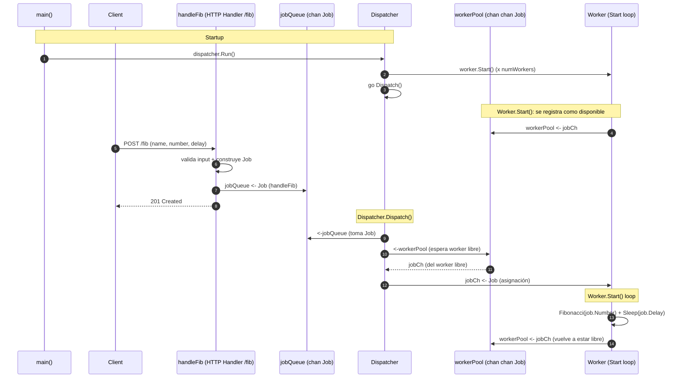

# 23_9_WebServer — Worker Pool con `chan chan`

Endpoint HTTP (`POST /fib`) que encola jobs y los procesa en background con un worker pool.

## Arquitectura

- `jobQueue` (`chan Job`): cola global de trabajo (handler → dispatcher).
- `jobCh` (`chan Job`): inbox privado de cada worker (dispatcher → worker).
- `workerPool` (`chan chan Job`): pool de disponibilidad; transporta `jobCh` de workers libres.

## Diagrama de secuencia (Mermaid)



## Cómo probar

1. Ejecuta el servidor:

```bash
go run ./23_9_WebServer
```

2. En otra terminal, envía un job:

```bash
curl -i -X POST "http://localhost:8000/fib" \
  -d "name=test" \
  -d "number=10" \
  -d "delay=500ms"
```

### Ejemplo: encolar varios jobs seguidos

Este comando encola 3 jobs (con distintos `number` y `delay`) en secuencia:

```bash
curl --location --request POST 'http://localhost:8000/fib' \
  --header 'Content-Type: application/x-www-form-urlencoded' \
  --data-urlencode 'name=fib25' \
  --data-urlencode 'number=25' \
  --data-urlencode 'delay=3s' \
&& curl --location --request POST 'http://localhost:8000/fib' \
  --header 'Content-Type: application/x-www-form-urlencoded' \
  --data-urlencode 'name=fib30' \
  --data-urlencode 'number=30' \
  --data-urlencode 'delay=1s' \
&& curl --location --request POST 'http://localhost:8000/fib' \
  --header 'Content-Type: application/x-www-form-urlencoded' \
  --data-urlencode 'name=fib2' \
  --data-urlencode 'number=2' \
  --data-urlencode 'delay=2s'
```

Salida esperada (ejemplo):

```text
❯ go run 23_9_WebServer/main.go
👷 worker 1 ready
👷 worker 0 ready
➡ Job fib25 queued 2025-12-30T23:44:13.928672-05:00
⏳ worker 0 started     fib(25)=?       Job fib25       sent: 2025-12-30T23:44:13.928672-05:00
➡ Job fib30 queued 2025-12-30T23:44:13.939388-05:00
⏳ worker 1 started     fib(30)=?       Job fib30       sent: 2025-12-30T23:44:13.939388-05:00
➡ Job fib2 queued 2025-12-30T23:44:13.949423-05:00
✅ worker 1 done        fib(30)=832040  Job fib30       sent: 2025-12-30T23:44:13.939388-05:00
👷 worker 1 ready
⏳ worker 1 started     fib(2)=?        Job fib2        sent: 2025-12-30T23:44:13.949423-05:00
✅ worker 0 done        fib(25)=75025   Job fib25       sent: 2025-12-30T23:44:13.928672-05:00
👷 worker 0 ready
✅ worker 1 done        fib(2)=1        Job fib2        sent: 2025-12-30T23:44:13.949423-05:00
👷 worker 1 ready
```

Notas:
- El orden de finalización depende de `delay` y del costo de `Fibonacci(n)`.
- `queued` refleja el timestamp cuando el handler encoló el job; `started/done` lo imprime el worker.

## Comparación con `23_7_WorkerPools`

- En `23_7_WorkerPools`, los workers compiten leyendo de una única cola (`jobs chan T`). No hay dispatcher explícito.
- Aquí existe un dispatcher y un `workerPool (chan chan Job)`: además de la cola de jobs, modelas disponibilidad de workers (cada worker publica su `jobCh`).

## Notas

- El orden de procesamiento no está garantizado.
- Si `jobQueue` se llena, el handler puede bloquear (backpressure).
